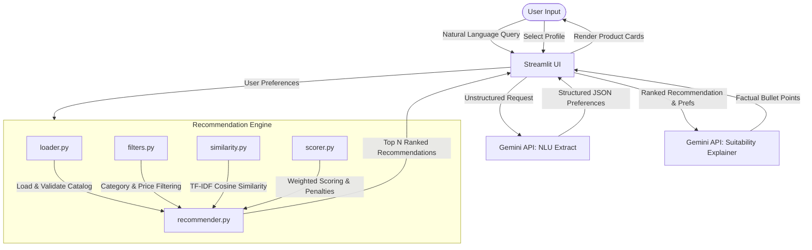

# Product Recommendation Agent

A modular, production-ready product recommendation system that combines deterministic scoring algorithms with Google's Gemini API for natural language understanding and explainable AI reasoning. The system enforces a strict separation of concerns: the core recommendation engine performs all filtering, scoring, and ranking deterministically, while the LLM is leveraged solely for preference extraction and suitability explanation.

## Project Overview

In hackathons and production environments, relying entirely on Large Language Models (LLMs) for ranking and filtering is slow, expensive, and prone to hallucinations. This project implements a hybrid approach:

1. **Natural Language Understanding (NLU)**: Google Gemini parses raw user descriptions into structured parameters (category, subcategory, budget, brand, and tags).
2. **Deterministic Recommendation Pipeline**: A Python-based engine filters the JSON catalog, vectorizes tags using TF-IDF, computes cosine similarities, normalizes ratings, and applies weighted scoring rules.
3. **Generative Suitability Explanations**: Gemini generates targeted, factual suitability reports explaining *why* the recommended products fit the user's specific context.

## Key Features

* **Natural Language Shopping Assistant**: Conversational input parsing that maps unstructured text requests into structured search parameters.
* **Taxonomy Constraint Mapping**: System instructions guarantee that natural language extractions map precisely onto valid database categories, subcategories, and brands.
* **Deterministic Scoring Engine**: Combines tag similarity, budget matching (with over-budget penalties), brand matching, ratings, and category alignment.
* **Interactive Demo Mode**: Includes pre-configured user profiles (e.g., student, fitness enthusiast, home cook) to demonstrate the system immediately.
* **Explainable AI (XAI)**: Generates human-readable suitability reasoning on demand for each recommended product without hallucinating scores or rankings.
* **Modular Design**: Structured into independent, single-responsibility components suitable for scaling.

## System Architecture

The workflow and data boundary separation are structured as follows:



## Tech Stack

* **Language**: Python 3.13
* **Frontend**: Streamlit
* **AI & LLM**: Google Gemini API (using the official `google-genai` SDK)
* **Mathematical Operations**: scikit-learn (TF-IDF Vectorization, Cosine Similarity)
* **Environment Configuration**: python-dotenv

## Project Structure

```
.
├── app.py                     # Streamlit frontend application
├── catalog.json               # Product database catalog (102 products)
├── sample_users.json          # Pre-configured demo user profiles
├── requirements.txt           # Project dependencies
├── README.md                  # Documentation
├── integration_test.py        # Pipeline validation test suite
│
├── engine/                    # Core deterministic recommendation engine
│   ├── __init__.py
│   ├── loader.py              # Catalog loading, validation, and metadata queries
│   ├── filters.py             # Composable database filtering operations
│   ├── similarity.py          # TF-IDF tag vectorization and cosine similarity
│   ├── scorer.py              # Weighted scoring and budget penalty calculations
│   └── recommender.py         # Pipeline coordinator orchestrating filters and scorers
│
└── llm/                       # LLM reasoning layers
    ├── __init__.py
    └── gemini_reasoner.py     # Gemini client wrapping extraction and explanation tasks
```

## Installation

1. Clone the repository and navigate to the project directory:
   ```bash
   cd product_recommendation
   ```

2. Install the required Python packages:
   ```bash
   pip install -r requirements.txt
   ```

## Configuration

The application reads API credentials from environment variables.

1. Create a `.env` file in the root directory:
   ```env
   GOOGLE_API_KEY=your_actual_gemini_api_key
   ```
   *(Alternatively, the system will check for the `GEMINI_API_KEY` variable.)*

2. The `GeminiReasoner` automatically reads this file on initialization, skipping placeholder keys starting with `YOUR_` to ensure seamless loading.

## Running the Application

### Web UI
To launch the interactive Streamlit interface:
```bash
python3.13 -m streamlit run app.py
```
Open `http://localhost:8501` in your browser.

### Command-Line Integration Test
To run the automated pipeline validation:
```bash
python3.13 integration_test.py
```

## Example Usage

### 1. Unstructured User Query
A user inputs the following description:
> "I'm looking for a lightweight laptop under ₹80,000 for coding and college."

### 2. Extracted JSON Preferences
The `extract_preferences` service queries Gemini using JSON mode (`response_mime_type="application/json"`), producing:
```json
{
  "category": "Electronics",
  "subcategory": "Laptop",
  "budget": 80000,
  "preferred_brand": null,
  "preferred_tags": [
    "Coding",
    "Students",
    "Lightweight"
  ]
}
```

### 3. Recommendation Scoring & Explainability
The deterministic recommendation engine ranks matching products. When the user requests an explanation for the top-ranked item (e.g., *Dell G15 Ryzen Gaming Laptop*), the model responds with:
* **Category and Brand Fit**: The laptop aligns with your requested Electronics category and Laptop subcategory.
* **Budget Fit**: Priced at 78,000 INR, this fits within your maximum budget of 80,000 INR.
* **Tag Match**: Matches your requirements for "Coding" and "Students" tags, aligning with your coding and college needs.
* **Excellent Rating**: Has a user rating of 4.5/5.0, reflecting high customer satisfaction.

## Recommendation Engine Details

The scoring algorithm combines five parameters to determine the final suitability score (clamped between `0.0` and `1.0`):

| Weight | Parameter | Scoring Strategy |
| :--- | :--- | :--- |
| **40%** | Tag Similarity | Cosine similarity between TF-IDF vectorized catalog tags and user preferred tags. |
| **25%** | Budget Match | Full score if within budget. Partial score (`0.5`) if up to 20% over budget. Severe penalty (`-0.5`) if over 20% above budget. |
| **15%** | Brand Match | Direct match against preferred brand (`1.0` or `0.0`). |
| **10%** | Product Rating | Normalized value based on the catalog rating (`rating / 5.0`). |
| **10%** | Category Fit | Weighted score based on direct Category and Subcategory matching. |

## AI Agent Workflow

The `GeminiReasoner` class utilizes the new `google-genai` SDK and is configured with robust networking defaults:
* **Timeout**: 10 seconds.
* **Retries**: Up to 3 attempts.
* **Failsafe**: In the event of an API failure, the application intercepts the error and returns a fallback message (`"AI explanation is currently unavailable."`), preventing user-facing crashes.

## Testing

The project maintains an integration test suite validating:
* Catalog parsing and schema validation.
* Chained execution of database filters.
* Score normalization and sorting accuracy.
* Deduplication of recommendations.

Run the test suite using:
```bash
python3.13 integration_test.py
```
